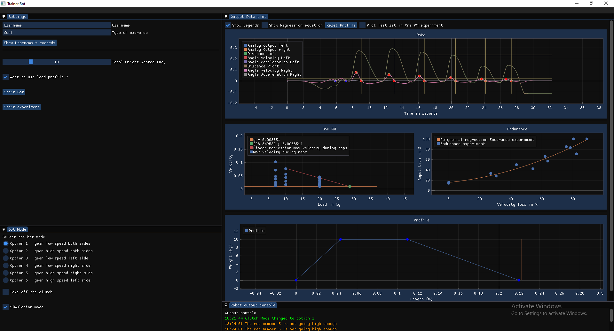

# Coach Bot

CoachBot is a C++ application that controls and gets data from fitness robots. 
The robots use motors to apply a specific torque to the fitness bar so the user can lift it like a regular bar with plate weights. 

This project was the subject of my four-month internship within the Hashimoto Laboratory at the Tokyo University of Science. 

  
  

## Goals 

The project aims to estimate the athlete's One-Repetition maximum (OneRM). The OneRM is the maximum load someone can lift in only one repetition. Trying to know one's OneRM requires lifting a hefty load. This can be dangerous for muscles and joints, especially for injured people. This is why we need to estimate it with lighter loads. 

The second goal is to estimate the athlete's Endurance. This is defined as the maximum number of repetitions an athlete can do at a specific load. This data reveals a lot about the athlete's performances and improvements.  

## Screenshot of the application's home page

## Technical brief description

The architecture of the project has a tentacular shape.   
It is separated into six main C++ classes that will interact with one another through the head class Trainer.

## Class Diagram

## Project Report

## Acknowledgement 

I am incredibly grateful to Professor Takuya Hashimoto, who trusted me and welcomed me into his laboratory at the Tokyo University of Science. His support gave me the opportunity to gain valuable experience in a country that was entirely new to me. Under his advice, I enhanced my technical skills in both development and robotics. Moreover, I discovered the unique and fascinating Japanese work culture, which enriched my personal and professional growth. This experience has been exceptional, and I owe much of it to his mentorship.

  
  

## Authors

- [@Clem-Pat](https://www.github.com/Clem-Pat)

